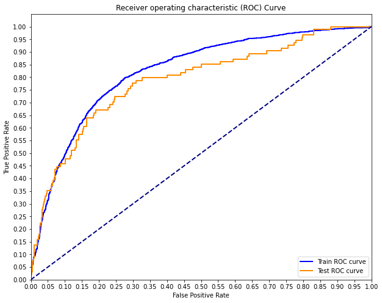

# SYRIATEL TELECOM ANALYSIS
**Author:** [Daniel Omondi Oselu](https://github.com/danieloselu3)

## OVERVIEW
Building a classifier to predict whether a customer will ("soon") stop doing business with SyriaTel, a telecommunications company.

## BUSINESS PROBLEM
Assisting The Acquisitions team to be able to detect customers likely to unsubscribe from the service, the Product development team to know for the clients who leave, what kinds of products were they dissatisfied with that might have caused them to leave, and what new products might they produce for the existing customers, the sales team to know the amount of revenue they might lose, if the customers were to leave.


Image by <a href="https://pixabay.com/users/mmisof-1574106/?utm_source=link-attribution&amp;utm_medium=referral&amp;utm_campaign=image&amp;utm_content=1010862">Michael Misof</a> from <a href="https://pixabay.com//?utm_source=link-attribution&amp;utm_medium=referral&amp;utm_campaign=image&amp;utm_content=1010862">Pixabay</a>

## DATA UNDESTANDING
The dataset is contained in a CSV(comma separated Values) file, stored in the *`data/`* folder in the current folder. The target we'll be using is the churn column, that indicates to us if the client churned or not. Our dataset contains 3333 datapoints/rows and 21 columns giving details about each datapoint. Which is not a lot, but enough for this particular analysis. 

The dataset available contains information about a particular customer, and it can be downloaded from Kaggle at [SyriaTel Dataset](https://www.kaggle.com/datasets/becksddf/churn-in-telecoms-dataset).

## METHODS
For the Data Science Process, we use the **CRISP_DM Data Science Process**.


The CRoss Industry Standard Process for Data Mining (CRISP-DM) is a process model that serves as the base for a data science process. It has six sequential phases:

**`Business understanding`** – What does the business need?
**`Data understanding`** – What data do we have / need? Is it clean?
**`Data preparation `**– How do we organize the data for modeling?
**`Modeling`** – What modeling techniques should we apply?
**`Evaluation`** – Which model best meets the business objectives?
**`Deployment`** – How do stakeholders access the results?

For the models iterations are developed by methodically improving from prior models, we start by building a base model, which is the model of our target feature with the highest correlated feature.

We then iteratively add more features, while trying to settle on the best model.

## MODELLING
In our modelling, we used different algorithms, and tried to tune the hyperparameters to get ourself a better model.

Our final model had an Accuracy score of 79%, and an ROC and AUC as shown below;




The confusion matrix for our model on the test set was as below


## RESULTS
| Question of interest       | Finding        |
| ------------- |-------------|
| What is the distribution of Expenditure by Time of the day?     | From our distribution, we can see that `day generates for us the highest revenue at more than 100,000`<br> and international calls generate the least revenue at less than 10,000. |
| What is the distribution of Revenue by State?     | From our top ten highest revenue states, `West Virginia leads with over 6000`, with the rest<br> generating revenue between 5000 and 4000     |
| What is the distribution of revenue by Area Codes? | Our data shows us that `Area code 415 is our highest grosser with revenue around 100,000`<br> followed by area code 408 the 510.      |
| What is the relationship between account length and Expenditure? | `It is not true that accounts that have been active for longer will`<br> `spend more` on average than accounts that have been around for much short period.      |
| What is the relationship between having a plan and expenditure? | `Accounts with international plans tend to spend more` on average than those without international plan.     |


## REPOSITORY STRUCTURE

```
├── code
│   ├── __init__.py
|
├── data
├── images
├── __init__.py
├── README.md
├── syriatel_analysis_presentation.pdf
└── syriatel_telecom_analysis.ipynb
```